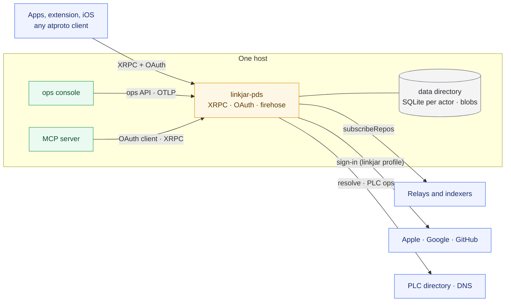

# LinkJar PDS

An AT Protocol Personal Data Server in Rust, compatible with the reference
implementation, with LinkJar's account behaviour as native extension points
instead of source patches. Dual-licensed MIT or Apache-2.0.

> Status: unit 0 of 13. The workspace builds, the syntax and data-model
> crates pass the upstream interop vectors, the API types are generated from
> the vendored lexicons, and the specification is complete; the server does
> not serve traffic yet. The reference image under
> [`legacy/`](legacy/README.md) remains the deployed server until cutover.
> Progress is logged in [docs/plan.md](docs/plan.md#status).

## Start here

| Read | For |
|---|---|
| [docs/README.md](docs/README.md) | The documentation map |
| [docs/architecture/README.md](docs/architecture/README.md) | Diagrams of every part of the system, kept current with the code |
| [docs/SPEC.md](docs/SPEC.md) | The normative specification (RFC 2119) |
| [docs/plan.md](docs/plan.md) | Decision record, owner decisions, delivery units, status |
| [docs/sidecars.md](docs/sidecars.md) | The operations console and the MCP server |
| [docs/research/](docs/research/) | What other systems do, and the gap report against atproto.com |

## What it is



The server is one binary. Behaviour that varies per operator sits behind
extension traits: the `stock` profile reproduces the reference server, the
`linkjar` profile adds LinkJar's sign-in providers, handle policy, creation
receipt, sign-in methods and mail. Everything else, from the repository
engine to the firehose, is shared.

## Repository layout

| Path | Contents |
|---|---|
| `crates/` | The workspace crates, one per subsystem ([architecture](docs/architecture/README.md#crates)) |
| `crates/linkjar-pds/` | The binary |
| `xtask/` | Repository tasks: `cargo xtask codegen` generates API types from the lexicons |
| `lexicons/` | Vendored upstream lexicons at the pin, LinkJar lexicons, project lexicons ([notice](lexicons/NOTICE.md)) |
| `interop/` | CC0 interop test vectors from upstream ([notice](interop/README.md)) |
| `fuzz/` | cargo-fuzz targets for every parser of untrusted bytes |
| `parity/` | The parity harness against the reference image (unit 1) |
| `docs/` | Specification, plan, architecture, research ([map](docs/README.md)) |
| `legacy/` | The reference-image build with its patches, tests, recovery tooling and staging files; frozen except security fixes ([legacy README](legacy/README.md)) |
| `upstream.json` | The reference pin shared by the legacy build and the vendored lexicons |

## Build and check

Requirements: the toolchain in `rust-toolchain.toml` through rustup, or
`devenv shell`, which provides it with cargo-deny, cargo-vet, cargo-audit and
the parity harness's Node.

```sh
cargo build --workspace
cargo test --workspace
cargo xtask codegen --check     # generated types are current
cargo deny check                 # advisories, licences, bans, sources
devenv shell -- pds:check        # everything CI runs
```

## Contributing

Work happens in bounded units that each end in a merge with their gate green
([docs/plan.md](docs/plan.md#delivery-units)). The specification is the
source of truth; a change in behaviour starts with a change there. Every
architecture diagram in `docs/architecture/` is updated in the same change as
the code it describes.
