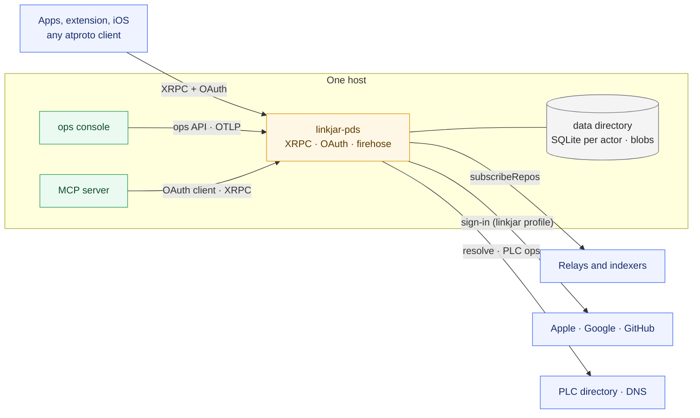

# LinkJar PDS

An AT Protocol Personal Data Server in Rust, compatible with the reference
implementation, with LinkJar's account behaviour as native extension points
instead of source patches. Dual-licensed MIT or Apache-2.0.

> **Status, 2026-10-14.** Every unit of the [plan](docs/plan.md) has code
> on `main`: reads, writes and the firehose on a data directory that the
> reference server started; accounts, OAuth and the `linkjar` profile; the
> audit log; the operations console and the MCP server; Postgres; and the
> entryway. The [parity harness](parity/README.md) passes its default
> scenarios against the server alone, on Postgres, and behind an entryway.
> The reference image under [`legacy/`](legacy/README.md) remains the
> deployed server until the cutover. The steps before the cutover are the
> owner's; the plan lists them with checkboxes.

## Start here

| Read | For |
|---|---|
| [docs/README.md](docs/README.md) | The documentation map |
| [docs/architecture/README.md](docs/architecture/README.md) | One diagram per part of the system, rendered with beautiful-mermaid, kept current with the code |
| [docs/SPEC.md](docs/SPEC.md) | The normative specification (RFC 2119) |
| [docs/plan.md](docs/plan.md) | Status of each unit, the owner's steps, what is not built, decisions |
| [docs/sidecars.md](docs/sidecars.md) | The operations console and the MCP server |
| [docs/research/](docs/research/) | What other systems do, and the gap report against atproto.com |
| [.agent_sources/README.md](.agent_sources/README.md) | Checkouts of the pinned upstream sources for reading: `scripts/vendor-agent-sources.sh` |

## What it is


```mermaid
flowchart LR
  classDef ext fill:#eef3ff,stroke:#4a6cf7,color:#1b2b6b
  classDef pds fill:#fff7e6,stroke:#e0960f,color:#5a3b00
  classDef side fill:#eafaf1,stroke:#2e9e5b,color:#0f4d2a
  classDef store fill:#f4f4f5,stroke:#71717a,color:#27272a

  clients["Apps, extension, iOS<br/>any atproto client"]:::ext
  relay["Relays and indexers"]:::ext
  idp["Apple · Google · GitHub"]:::ext
  plc["PLC directory · DNS"]:::ext

  subgraph host["One host"]
    pds["linkjar-pds<br/>XRPC · OAuth · firehose"]:::pds
    data[("data directory<br/>SQLite per actor · blobs")]:::store
    console["ops console"]:::side
    mcp["MCP server"]:::side
  end

  clients -- "XRPC + OAuth" --> pds
  pds -- "subscribeRepos" --> relay
  pds -- "sign-in (linkjar profile)" --> idp
  pds -- "resolve · PLC ops" --> plc
  pds --- data
  console -- "ops API · OTLP" --> pds
  mcp -- "OAuth client · XRPC" --> pds
```

The server is one binary. Behaviour that varies per operator sits behind
extension traits: the `stock` profile reproduces the reference server, the
`linkjar` profile adds LinkJar's sign-in providers, handle policy, creation
receipt, sign-in methods and mail. Everything else, from the repository
engine to the firehose, is shared.

## Repository layout

| Path | Contents |
|---|---|
| `crates/` | The workspace crates, one per subsystem ([architecture](docs/architecture/README.md#crates)) |
| `crates/linkjar-pds/` | The binary: `serve`, `verify`, `export-car`, `check-config`, `health`, `version` |
| `crates/pds-sim/` | The simulation: `pds-sim --seeds N` runs seeded plans against the server in process |
| `Dockerfile` | The server's image |
| `xtask/` | Repository tasks: `cargo xtask codegen` generates API types from the lexicons |
| `lexicons/` | Vendored upstream lexicons at the pin, LinkJar lexicons, project lexicons ([notice](lexicons/NOTICE.md)) |
| `interop/` | CC0 interop test vectors from upstream ([notice](interop/README.md)) |
| `fuzz/` | cargo-fuzz targets for every parser of untrusted bytes |
| `parity/` | The parity harness: the compose stack, scenarios and oracles that hold a target to the reference image ([README](parity/README.md)) |
| `docs/` | Specification, plan, architecture, research ([map](docs/README.md)) |
| `legacy/` | The reference-image build with its patches, tests, recovery tooling and staging files; frozen except security fixes ([legacy README](legacy/README.md)) |
| `upstream.json` | The reference pin shared by the legacy build and the vendored lexicons |

## Build and check

Requirements: the toolchain in `rust-toolchain.toml` through rustup, or
`devenv shell`, which provides it with cargo-deny, cargo-vet, cargo-audit and
the parity harness's Node.

```sh
cargo build --workspace
cargo test --workspace
cargo xtask codegen --check     # generated types are current
cargo deny check                 # advisories, licences, bans, sources
cargo run -p pds-sim -- --seeds 20   # the simulation; its build needs libclang
cargo run -p pds-sim -- --network    # the same server on a simulated network
devenv shell -- pds:check        # the Rust gates of CI
devenv shell -- pds:hooks        # the rustfmt and clippy hooks, by hand
```

Run the server on a copy of a reference data directory, and check the copy:

```sh
export PDS_HOSTNAME=pds.example.com PDS_DATA_DIRECTORY=/path/to/copy \
       PDS_BLOBSTORE_DISK_LOCATION=/path/to/copy/blocks \
       PDS_JWT_SECRET=... PDS_ADMIN_PASSWORD=...
cargo run -p linkjar-pds -- verify   # reads only; exit 1 on a difference
cargo run -p linkjar-pds -- serve    # port 2583
```

For blobs in an S3-compatible store, set the reference server's
`PDS_BLOBSTORE_S3_*` variables in place of `PDS_BLOBSTORE_DISK_LOCATION`
(SPEC Appendix C). `verify` then lists the bucket and changes nothing in it;
`serve` writes to it, so point it at a copy of the bucket.

The variables are the reference server's (SPEC Appendix C). `serve` writes
to the copy: records, blobs, events, sessions and new accounts, the DID
cache, and its own file `ops.sqlite`. It creates an account only with
`PDS_PLC_ROTATION_KEY_K256_PRIVATE_KEY_HEX` set, and then it writes to the
PLC directory that `PDS_DID_PLC_URL` names: point that at a directory of
your own when you try it.

`devenv shell` installs no git hook. Linked worktrees share one `.git/hooks`,
so an installed hook would run for every worktree with the configuration of
one.

The parity harness needs Docker and runs on its own
([parity/README.md](parity/README.md#run-it)):

```sh
cd parity && pnpm install
pnpm parity run reference        # scenarios against the reference image
pnpm parity compare reference repeat
pnpm parity images build-candidate
pnpm parity restore              # the Rust server on the reference's data
pnpm parity writes               # writes and the firehose on both servers
```

## Measurements

Four files hold the numbers measured so far:

- [parity/results/perf-reads.md](parity/results/perf-reads.md): the reads
  of both servers on one data directory with a repository of 100,000
  records. The median `sync.getRepo` export of five runs took 1,385 ms on
  the reference server and 167 ms on the Rust server, for the same bytes.
  Memory before the first request was 280.4 MiB and 5.4 MiB.
- [parity/results/perf-writes.md](parity/results/perf-writes.md): writes
  on each server. With 1,000 records in the repository, one `createRecord`
  took 14.4 ms on the reference server and 4.9 ms on the Rust server at
  p50; a batch of 200 took 190.3 ms and 14.3 ms. With 100,000 records the
  single write took 14.5 ms and 11.5 ms.
- [parity/results/perf-reference.md](parity/results/perf-reference.md): the
  reference server's baseline for the single-write, batch-write, export,
  fan-out, backfill, concurrent-uploads and many-writers scenarios of SPEC
  §16.1.
- [bench/README.md](bench/README.md): the repository engine beside
  `rsky-repo` on the same vectors and workload, the evidence for the
  decision on the repository engine.

Each of the three result files is one run on one host, an Apple M1 Pro under
Docker, and says of itself that it is not a benchmark. The requests in the
read measurements are sequential, so they say nothing about throughput
under load.

## Contributing

Work happens in bounded units that each end in a merge with their gate green
([docs/plan.md](docs/plan.md#units)). The specification is the
source of truth; a change in behaviour starts with a change there. Every
architecture diagram in `docs/architecture/` is updated in the same change as
the code it describes.
