# Architecture

[Documentation](../README.md) · [Specification](../SPEC.md) · [Plan](../plan.md)

One diagram per part of the system. Each diagram names the crate or file
that implements it and the SPEC section that governs it. A change to the
code updates the diagram in the same commit; a diagram that drifts is a
bug. Diagrams are Mermaid and render on GitHub.

Legend used throughout: blue is outside the host, amber is the PDS process,
green is a sidecar, grey is storage, red is an extension point.

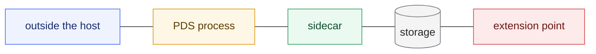

## Contents

- [System context](#system-context)
- [Crates](#crates)
- [Process and listeners](#process-and-listeners)
- [Write path](#write-path)
- [Sequencer and firehose](#sequencer-and-firehose)
- [Storage layout and seams](#storage-layout-and-seams)
- [Identity](#identity)
- [OAuth: stock sign-in](#oauth-stock-sign-in)
- [OAuth: LinkJar external sign-in](#oauth-linkjar-external-sign-in)
- [Extension model](#extension-model)
- [Audit log](#audit-log)
- [Simulation harness](#simulation-harness)
- [Parity harness](#parity-harness)
- [Deployment topologies](#deployment-topologies)
- [Sidecars](#sidecars)
- [Cutover and rollback](#cutover-and-rollback)
- [Repository and build](#repository-and-build)

## System context

SPEC §1, §21.1. Who talks to the PDS and over what.

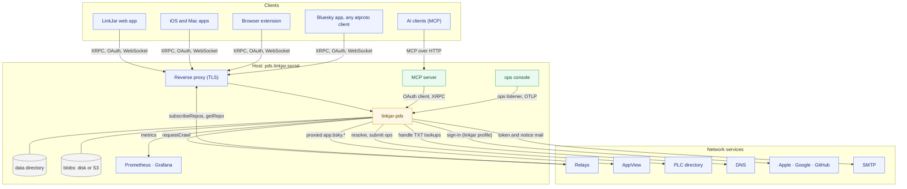

## Crates

SPEC §3.1. Arrows point from a crate to the crates it depends on. The
binary wires everything; extension crates depend only on the trait crate.

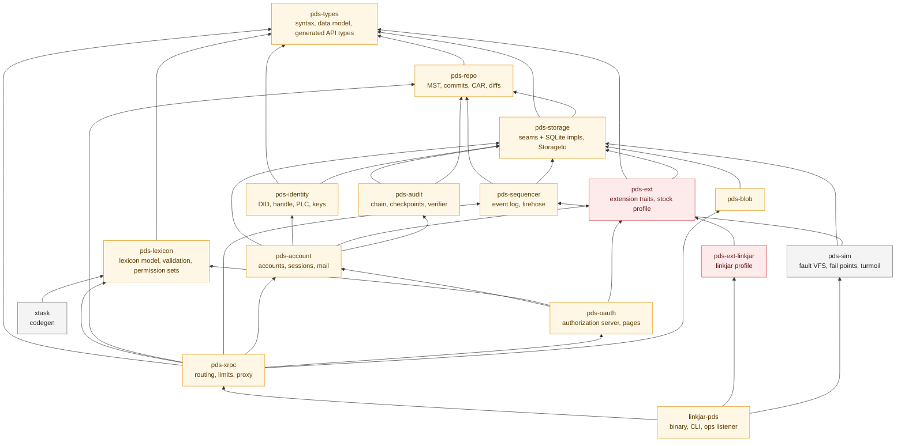

## Process and listeners

SPEC §3.2, §4.1, §14.3. One process, three listeners, supervised background
tasks, injectable time and randomness.

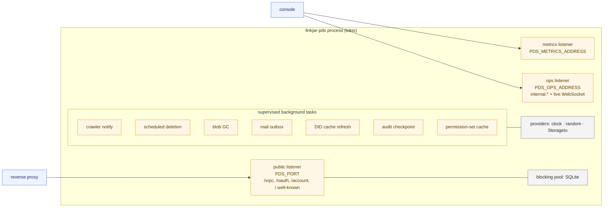

## Write path

SPEC §6.3, §6.4, §7.4. What happens on `createRecord` and why the sequencer
row is durable with the commit.

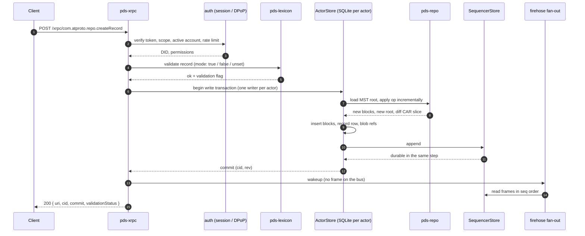

## Sequencer and firehose

SPEC §7. Frames come only from the durable log; the broadcast is a wakeup.

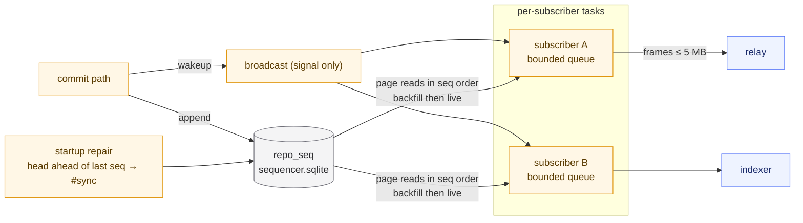

Cursor rules (SPEC §7.3): no cursor → live; `0` → whole window; in window →
backfill then live; above head → `FutureCursor`; older than the window →
`#info OutdatedCursor`; slow consumer → `ConsumerTooSlow`.

## Storage layout and seams

SPEC §8. The reference layout on disk, the Candidate-only files beside it,
and the traits every subsystem goes through.

```mermaid
flowchart TB
  classDef store fill:#f4f4f5,stroke:#71717a,color:#27272a
  classDef pds fill:#fff7e6,stroke:#e0960f,color:#5a3b00
  classDef new fill:#fdeaea,stroke:#d64545,color:#6b1515

  subgraph seams["pds-storage seams (traits)"]
    as["ActorStore"]:::pds
    acc["AccountStore"]:::pds
    seq["SequencerStore"]:::pds
    bs["BlobStore"]:::pds
    dc["DidCache"]:::pds
    au["AuditStore"]:::pds
    io["StorageIo<br/>(OS files, or fault VFS in tests)"]:::pds
  end
  subgraph dir["PDS_DATA_DIRECTORY (reference layout)"]
    a[("account.sqlite")]:::store
    s[("sequencer.sqlite")]:::store
    d[("did_cache.sqlite")]:::store
    audit[("audit.sqlite · Candidate-only")]:::new
    opsdb[("ops.sqlite · Candidate-only")]:::new
    subgraph actors["actors/&lt;2 hex&gt;/&lt;did&gt;/"]
      st[("store.sqlite")]:::store
      key["key (signing key)"]:::store
    end
    rk["actors/reserved_keys/"]:::store
  end
  subgraph blobs["PDS_BLOBSTORE_DISK_LOCATION or S3"]
    b[("&lt;did&gt;/&lt;cid&gt;")]:::store
    tmp["tempt/&lt;did&gt;/"]:::store
    q["quarantine/&lt;did&gt;/"]:::store
  end
  as --- st & key
  acc --- a
  seq --- s
  dc --- d
  au --- audit
  bs --- b & tmp & q
  as & acc & seq & dc & au --- io
```

Schema version 1 equals the reference schema in the shared files, so the
reference image can serve the same directory during the rollback window.

## Identity

SPEC §9. Resolution paths and what the server trusts.

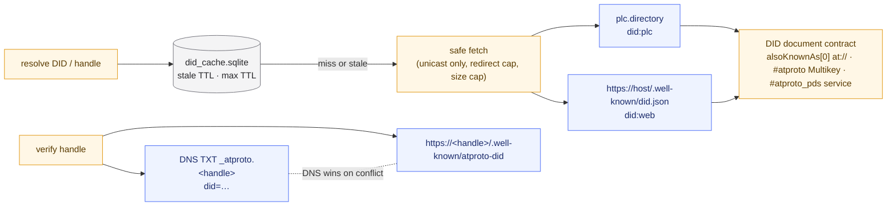

## OAuth: stock sign-in

SPEC §11. The authorization-code flow with PAR, PKCE and DPoP against the
server's own pages.

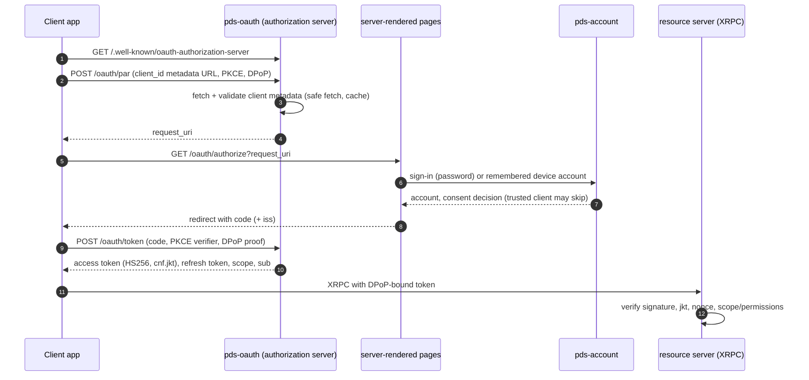

## OAuth: LinkJar external sign-in

SPEC §12.3, §13. The same flow with the `linkjar` profile's identity
providers inserted at the sign-in step; the receipt and handle policy hooks
run inside the account transaction.

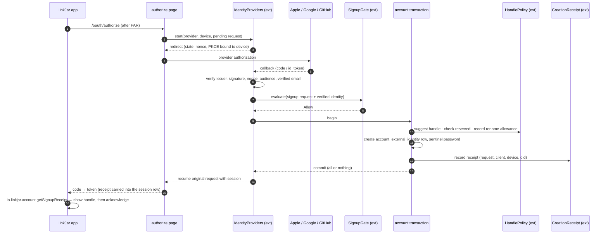

## Extension model

SPEC §12. The core calls traits; a profile composes one implementation of
each; selection is `PDS_PROFILE`.

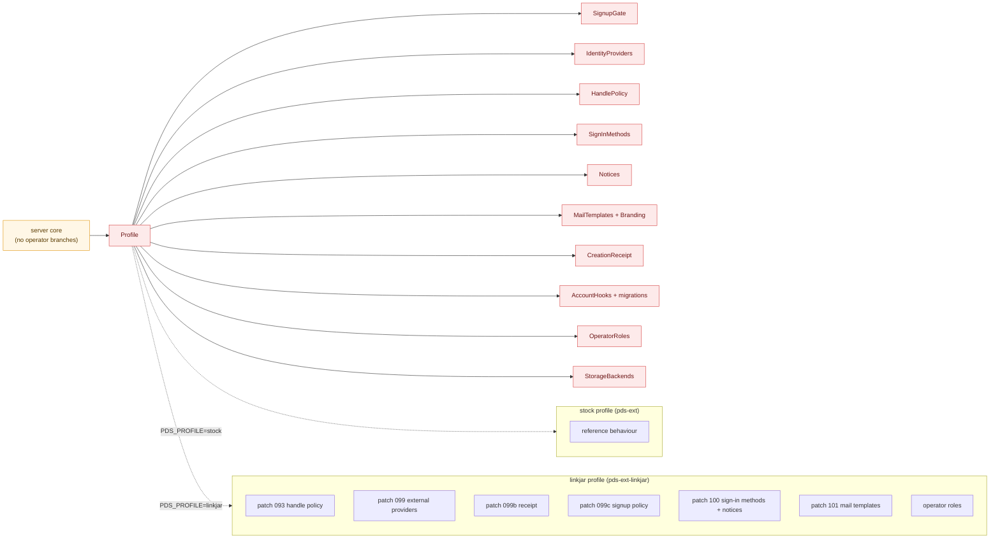

Rules: no request field sets an internal flag; hook writes commit in the
account transaction; hooks fail closed; every hook that changes account
state produces an audit entry.

## Audit log

SPEC §20. Insert-only entries, a hash chain, signed checkpoints, and the
firehose as the witness.

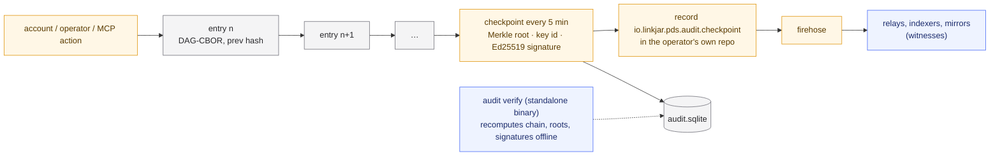

## Simulation harness

SPEC §19. One seed drives faults in storage, process and network; oracles
check verify, repair and firehose delivery.

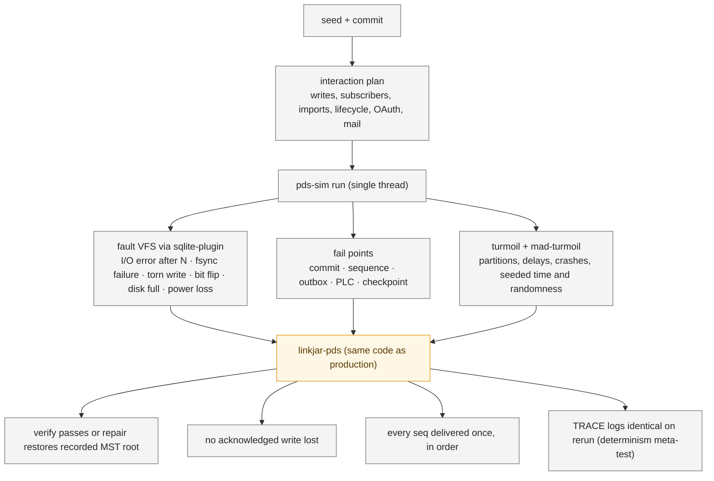

## Parity harness

SPEC §17. Same scenario, two servers, eight oracles. Fault scenarios run
against the Candidate alone.

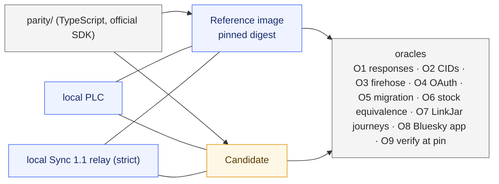

## Deployment topologies

SPEC §21. Version 1 is one node. Scale follows the protocol: an entryway
over member hosts. The shared-database cluster is documented, not
recommended.

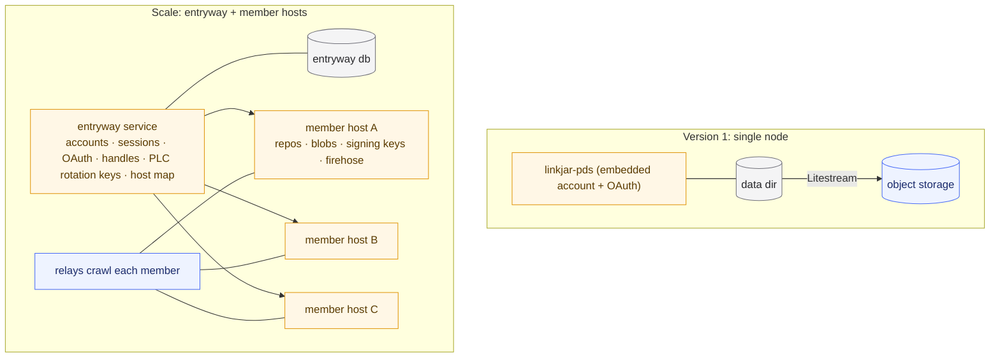

## Sidecars

[sidecars.md](../sidecars.md), SPEC §22. Neither sidecar holds a database
connection or a signing key.

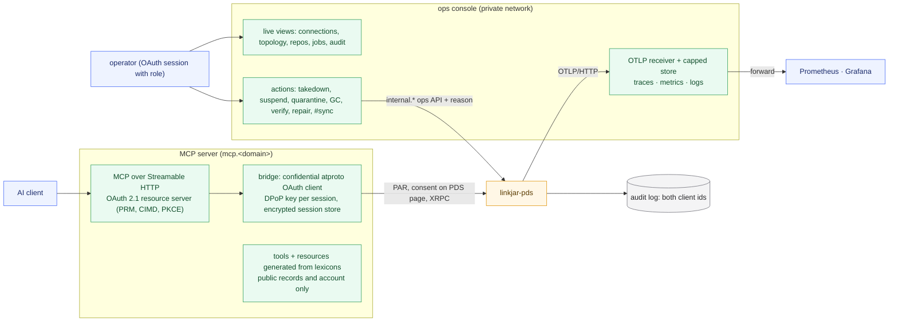

## Cutover and rollback

SPEC §18. Same hostname, same directory, same secrets; the window stays
open until the first Candidate-only migration.

```mermaid
stateDiagram-v2
  [*] --> Reference: production today
  Reference --> Verify: stop container · run verify
  Verify --> Candidate: start linkjar-pds on same dir + secrets
  Candidate --> Smoke: health · describeServer · OAuth metadata · relay resumes cursor
  Smoke --> Watch: web, iOS, extension sign-in · write · firehose · mail
  Watch --> Reference: rollback (start Reference image; Candidate-only files ignored)
  Watch --> Closed: migrate --allow-candidate-only (window closes)
  Closed --> [*]
```

## Repository and build

How the repository is organised and what the gates run.

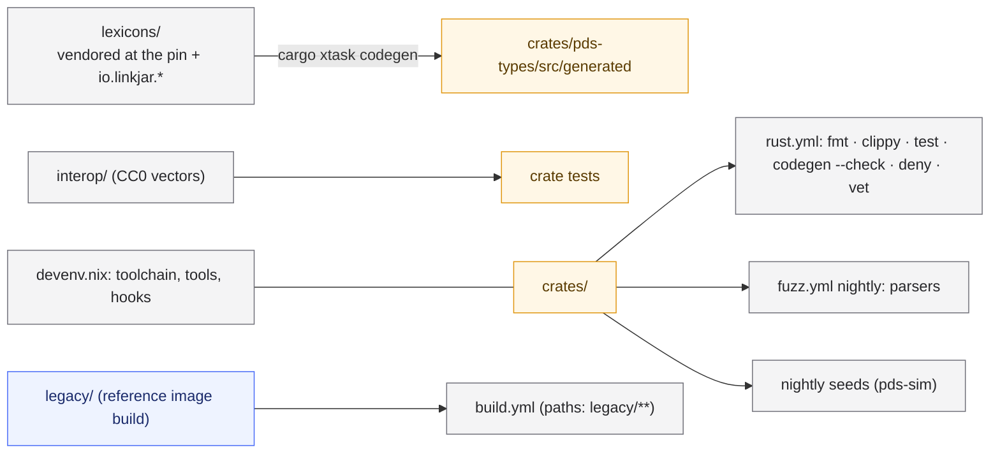
